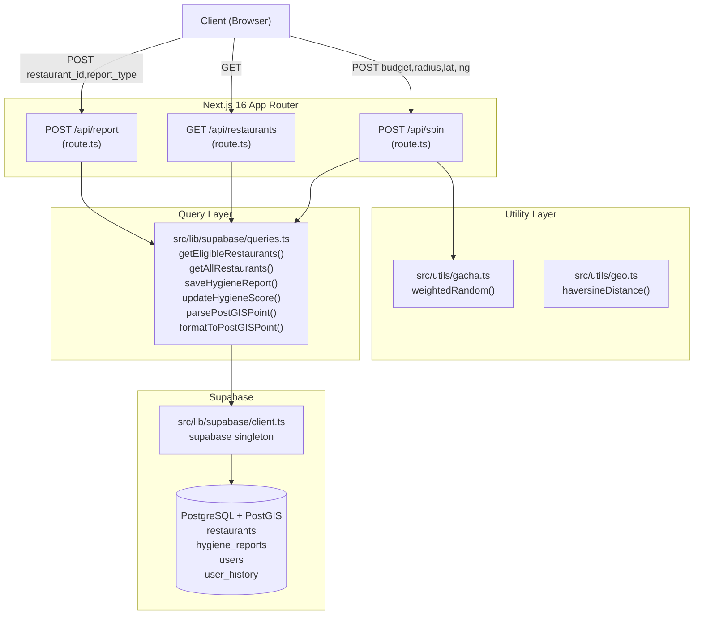
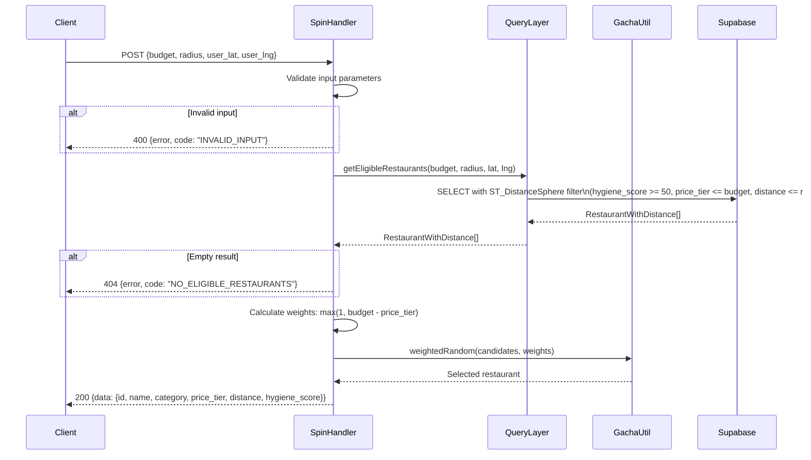
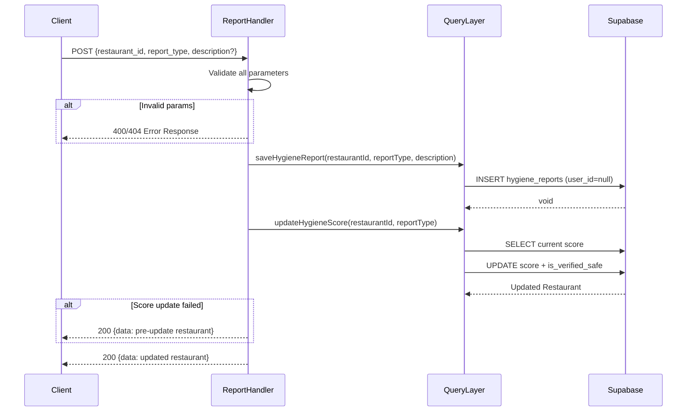

# Design Document: Gacha Makan Backend

## Overview

Dokumen ini mendeskripsikan desain teknis untuk lapisan back-end aplikasi **Gacha Makan** — sebuah fitur yang membantu mahasiswa Jatinangor menemukan warung makan secara acak berdasarkan budget dan radius lokasi.

Sistem terdiri dari tiga lapisan utama:

1. **API Handlers** — tiga Next.js 16 Route Handlers (`/api/spin`, `/api/restaurants`, `/api/report`) yang menggunakan Web `Request`/`Response` API standar.
2. **Query Layer** (`src/lib/supabase/queries.ts`) — abstraksi semua operasi baca/tulis ke Supabase (PostgreSQL + PostGIS).
3. **Utility Modules** — dua pure function module: `src/utils/gacha.ts` (weighted random selection) dan `src/utils/geo.ts` (kalkulasi jarak haversine).

Semua endpoint beroperasi dalam **Guest Mode** (tanpa autentikasi) untuk MVP. Filter higienitas diterapkan secara mutlak sebelum seleksi acak, sehingga warung dengan skor rendah tidak pernah muncul sebagai hasil spin.

---

## Architecture

### Diagram Alur Sistem



### Alur Spin (POST /api/spin)



### Alur Report (POST /api/report)



---

## Components and Interfaces

### TypeScript Types

```typescript
// Tipe dasar Restaurant dari database
interface Restaurant {
  id: string;
  name: string;
  category: string | null;
  price_tier: number;
  location: unknown; // PostGIS geography — diparse oleh Query Layer
  hygiene_score: number;
  is_verified_safe: boolean;
  created_at: string;
}

// Restaurant dengan field distance untuk hasil spin
interface RestaurantWithDistance {
  id: string;
  name: string;
  category: string | null;
  price_tier: number;
  hygiene_score: number;
  distance: number; // integer meters, dibulatkan
}

// Restaurant dengan koordinat terpisah untuk peta
interface RestaurantWithCoords {
  id: string;
  name: string;
  category: string | null;
  price_tier: number;
  hygiene_score: number;
  is_verified_safe: boolean;
  lat: number;
  lng: number;
  hygiene_status: 'RED' | 'GREEN';
}

// Response shapes
type SuccessResponse<T> = { data: T };
type ErrorResponse = { error: string; code: string };
```

### Route Handler Signatures (Next.js 16)

Route Handlers menggunakan Web API `Request` dan `Response` standar sesuai konvensi Next.js 16 App Router. Setiap handler diekspor sebagai named async function dengan nama HTTP method.

```typescript
// src/app/api/spin/route.ts
export async function POST(request: Request): Promise<Response>

// src/app/api/restaurants/route.ts
export async function GET(request: Request): Promise<Response>

// src/app/api/report/route.ts
export async function POST(request: Request): Promise<Response>
```

Response dibuat menggunakan `Response.json()` (bukan `NextResponse`) sesuai requirement 10.6.

### Query Layer Interface

```typescript
// src/lib/supabase/queries.ts

export function getEligibleRestaurants(
  budget: number,
  radiusMeters: number,
  userLat: number,
  userLng: number
): Promise<RestaurantWithDistance[]>

export function getAllRestaurants(): Promise<RestaurantWithCoords[]>

export function saveHygieneReport(
  restaurantId: string,
  reportType: 'RED_FLAG' | 'CLEAN',
  description?: string
): Promise<void>

export function updateHygieneScore(
  restaurantId: string,
  reportType: 'RED_FLAG' | 'CLEAN'
): Promise<Restaurant>

export function parsePostGISPoint(
  geographyValue: unknown
): { lat: number; lng: number }

export function formatToPostGISPoint(lat: number, lng: number): string
```

### Utility Module Interfaces

```typescript
// src/utils/gacha.ts
export function weightedRandom<T>(items: T[], weights: number[]): T

// src/utils/geo.ts
export function haversineDistance(
  lat1: number,
  lng1: number,
  lat2: number,
  lng2: number
): number
```

---

## Data Models

### Database Schema (Existing)

```sql
-- Restaurants: warung makan dengan lokasi PostGIS
create table restaurants (
  id uuid default uuid_generate_v4() primary key,
  name text not null,
  category text,
  price_tier int,
  location geography(point) not null,
  hygiene_score int default 100,  -- range: 0-100
  is_verified_safe boolean default false,
  created_at timestamptz default now() not null
);

-- Hygiene Reports: laporan kebersihan dari user/guest
create table hygiene_reports (
  id uuid default uuid_generate_v4() primary key,
  user_id uuid references users(id),  -- nullable untuk Guest_User
  restaurant_id uuid references restaurants(id) not null,
  report_type text not null,  -- 'RED_FLAG' | 'CLEAN'
  description text,           -- max 1000 chars
  created_at timestamptz default now() not null
);
```

> **Catatan schema**: Kolom `user_id` di `hygiene_reports` harus nullable (tidak ada `NOT NULL` constraint) untuk mendukung Guest Mode. Schema yang ada di `supabase/schema.sql` memiliki `NOT NULL` pada kolom ini — perlu diubah menjadi nullable sebelum implementasi.

### PostGIS Point Format

Supabase mengembalikan kolom `geography(point)` dalam dua format tergantung query:

- **GeoJSON Geometry**: `{ "type": "Point", "coordinates": [longitude, latitude] }` — perhatikan urutan `[lng, lat]` sesuai standar GeoJSON.
- **WKT String**: `"POINT(longitude latitude)"` — format yang digunakan saat menyimpan data.

`parsePostGISPoint` harus menangani kedua format ini.

### Hygiene Score State Machine

```
Score awal: 100
RED_FLAG: score = max(0, score - 50)
CLEAN:     score = min(100, score + 20)

Jika score < 50 setelah update → is_verified_safe = false
Jika score >= 50 setelah CLEAN → is_verified_safe TIDAK berubah otomatis
```

### Weight Calculation

```
weight(restaurant) = max(1, budget - price_tier)
```

Setiap restaurant memiliki weight minimal 1, sehingga semua kandidat memiliki peluang terpilih. Restaurant yang lebih murah dari budget memiliki weight lebih tinggi.

---

## Correctness Properties

*A property is a characteristic or behavior that should hold true across all valid executions of a system — essentially, a formal statement about what the system should do. Properties serve as the bridge between human-readable specifications and machine-verifiable correctness guarantees.*

### Property 1: Hygiene Filter Excludes Low-Score Restaurants

*For any* array of restaurants with varying `hygiene_score` values, applying the hygiene filter SHALL produce a result set where every restaurant has `hygiene_score >= 50`.

**Validates: Requirements 1.1**

---

### Property 2: Budget and Radius Filter Correctness

*For any* set of restaurants with varying `price_tier` and distances, and any valid `budget` and `radius`, the filtered result SHALL contain only restaurants where `price_tier <= budget` AND `distance <= radius`.

**Validates: Requirements 2.1**

---

### Property 3: Input Validation Rejects Out-of-Range Parameters

*For any* spin request where at least one parameter is outside its valid range (`budget` ≤ 0 or > 100,000,000; `radius` ≤ 0 or > 50,000; `user_lat` outside [-90, 90]; `user_lng` outside [-180, 180]), the API SHALL return an error response with `code: "INVALID_INPUT"` and HTTP status 400.

**Validates: Requirements 2.3**

---

### Property 4: Weight Formula Correctness

*For any* restaurant with `price_tier` and any valid `budget`, the computed weight SHALL equal `max(1, budget - price_tier)`, ensuring every restaurant has a weight of at least 1.

**Validates: Requirements 3.1**

---

### Property 5: Weighted Random Result is Always a Member of Input

*For any* non-empty array of items and a corresponding array of valid weights (at least one positive), `weightedRandom(items, weights)` SHALL always return an element that is strictly a member of the `items` array.

**Validates: Requirements 3.5, 8.6**

---

### Property 6: Spin Response Contains All Required Fields

*For any* successful spin result, the response `data` object SHALL contain all six required fields: `id`, `name`, `category`, `price_tier`, `distance` (integer meters), and `hygiene_score`.

**Validates: Requirements 3.3**

---

### Property 7: Hygiene Status Classification Correctness

*For any* restaurant with a `hygiene_score`, the derived `hygiene_status` field SHALL be `"RED"` if `hygiene_score < 50` and `"GREEN"` if `hygiene_score >= 50` (inclusive of exactly 50).

**Validates: Requirements 4.3**

---

### Property 8: Hygiene Score Update Invariant

*For any* initial `hygiene_score` in [0, 100] and any valid `report_type` (`"RED_FLAG"` or `"CLEAN"`), the resulting score after update SHALL always remain within the range [0, 100] inclusive. Specifically: RED_FLAG produces `max(0, score - 50)` and CLEAN produces `min(100, score + 20)`.

**Validates: Requirements 6.1, 6.2, 6.7**

---

### Property 9: is_verified_safe Set to False When Score Drops Below 50

*For any* restaurant where a `"RED_FLAG"` report causes the `hygiene_score` to drop below 50, the `is_verified_safe` field SHALL be set to `false` after the update.

**Validates: Requirements 6.3**

---

### Property 10: haversineDistance Zero-Distance Property

*For any* valid coordinate pair `(lat, lng)` where `lat ∈ [-90, 90]` and `lng ∈ [-180, 180]`, calling `haversineDistance(lat, lng, lat, lng)` SHALL return a value less than or equal to `1e-9`.

**Validates: Requirements 7.2**

---

### Property 11: haversineDistance Symmetry

*For any* two valid coordinate pairs A and B, `|haversineDistance(A, B) - haversineDistance(B, A)|` SHALL be less than or equal to `1e-9`.

**Validates: Requirements 7.3**

---

### Property 12: haversineDistance Non-Negativity

*For any* two valid coordinate pairs, `haversineDistance` SHALL return a value greater than or equal to 0.

**Validates: Requirements 7.4**

---

### Property 13: haversineDistance Determinism

*For any* valid coordinate inputs, calling `haversineDistance` twice with the same arguments SHALL return identical values.

**Validates: Requirements 7.7**

---

### Property 14: haversineDistance Rejects Out-of-Range Inputs

*For any* coordinate where `lat` is outside [-90, 90] or `lng` is outside [-180, 180], `haversineDistance` SHALL throw an error with a message identifying the invalid parameter and its value.

**Validates: Requirements 7.5**

---

### Property 15: weightedRandom Rejects Mismatched Array Lengths

*For any* two arrays `items` and `weights` where `items.length !== weights.length`, `weightedRandom` SHALL throw an error with a descriptive message.

**Validates: Requirements 8.3**

---

### Property 16: weightedRandom Rejects All-Non-Positive Weights

*For any* non-empty `weights` array where every element is ≤ 0, `weightedRandom` SHALL throw an error with a descriptive message.

**Validates: Requirements 8.4**

---

### Property 17: PostGIS Coordinate Round-Trip

*For any* valid coordinate pair where `lat ∈ [-90, 90]` and `lng ∈ [-180, 180]`, the round-trip `parsePostGISPoint(formatToPostGISPoint(lat, lng))` SHALL produce `{ lat, lng }` where the absolute difference between input and output values does not exceed `1e-9`.

**Validates: Requirements 11.5**

---

### Property 18: formatToPostGISPoint Rejects Out-of-Range Coordinates

*For any* coordinate where `lat` is outside [-90, 90] or `lng` is outside [-180, 180], `formatToPostGISPoint` SHALL throw an error identifying the invalid parameter and its value.

**Validates: Requirements 11.4**

---

### Property 19: parsePostGISPoint Rejects Invalid Formats

*For any* value that is not a valid GeoJSON Point object or WKT `POINT(lng lat)` string, `parsePostGISPoint` SHALL throw an error describing the expected format and the received value/type.

**Validates: Requirements 11.2**

---

### Property 20: UUID Validation Rejects Non-UUID Strings

*For any* string that does not match the UUID format `xxxxxxxx-xxxx-xxxx-xxxx-xxxxxxxxxxxx`, the `/api/report` handler SHALL return an error response with `code: "INVALID_INPUT"` and HTTP status 400.

**Validates: Requirements 5.2**

---

### Property 21: report_type Validation Rejects Non-Enum Values

*For any* string that is neither `"RED_FLAG"` nor `"CLEAN"`, the `/api/report` handler SHALL return an error response with `code: "INVALID_REPORT_TYPE"` and HTTP status 400.

**Validates: Requirements 5.3**

---

### Property 22: Description Length Validation

*For any* description string with length greater than 1000 characters, the `/api/report` handler SHALL return an error response with `code: "INVALID_INPUT"` and HTTP status 400.

**Validates: Requirements 5.4**

---

## Error Handling

### Error Code Registry

| Code | HTTP Status | Trigger |
|------|-------------|---------|
| `INVALID_INPUT` | 400 | Missing/invalid parameters (budget, radius, lat, lng, restaurant_id, description length) |
| `INVALID_REPORT_TYPE` | 400 | `report_type` bukan `"RED_FLAG"` atau `"CLEAN"` |
| `NO_ELIGIBLE_RESTAURANTS` | 404 | Tidak ada restaurant yang lolos semua filter |
| `RESTAURANT_NOT_FOUND` | 404 | `restaurant_id` tidak ada di database |
| `DATABASE_ERROR` | 500 | Kegagalan koneksi, query timeout, permission error |
| `INTERNAL_ERROR` | 500 | Error server lainnya yang tidak terduga |

### Error Handling Strategy

Setiap Route Handler menggunakan pola `try/catch` tunggal yang menangkap semua exception dalam scope handler:

```typescript
export async function POST(request: Request): Promise<Response> {
  try {
    // 1. Parse & validate input
    // 2. Call Query Layer
    // 3. Apply business logic
    // 4. Return success response
    return Response.json({ data: result }, { status: 200 });
  } catch (error) {
    if (error instanceof KnownError) {
      return Response.json(
        { error: error.message, code: error.code },
        { status: error.status }
      );
    }
    console.error('[handler] Unexpected error:', error);
    return Response.json(
      { error: 'Internal server error', code: 'INTERNAL_ERROR' },
      { status: 500 }
    );
  }
}
```

### Query Layer Error Propagation

Query Layer melempar error dengan pesan deskriptif yang mengidentifikasi operasi yang gagal. API Handler menangkap error ini dan memetakannya ke `DATABASE_ERROR` atau `INTERNAL_ERROR`.

### Partial Failure: Report + Score Update

Jika `saveHygieneReport` berhasil tetapi `updateHygieneScore` gagal, handler mengembalikan `200` dengan data restaurant sebelum update (bukan error). Ini adalah keputusan desain yang dipilih untuk UX — laporan tetap tersimpan, dan score akan diperbarui pada laporan berikutnya.

---

## Testing Strategy

### Pendekatan Dual Testing

Strategi pengujian menggunakan dua lapisan yang saling melengkapi:

1. **Property-Based Tests** — memverifikasi properti universal yang harus berlaku untuk semua input valid, menggunakan library [fast-check](https://fast-check.io/) untuk TypeScript.
2. **Unit Tests (Example-Based)** — memverifikasi perilaku spesifik dengan contoh konkret, edge case, dan kondisi error.

### Property-Based Testing dengan fast-check

**Library**: `fast-check` (TypeScript-native, tidak perlu instalasi tambahan selain `npm install fast-check --save-dev`)

**Konfigurasi**: Setiap property test dijalankan minimum **100 iterasi** (default fast-check adalah 100, dapat ditingkatkan dengan `{ numRuns: 200 }` untuk fungsi kritis).

**Tag format**: Setiap property test diberi komentar referensi:
```typescript
// Feature: gacha-makan-backend, Property N: <property_text>
```

**Contoh implementasi property test**:

```typescript
import fc from 'fast-check';
import { weightedRandom } from '@/utils/gacha';

// Feature: gacha-makan-backend, Property 5: weightedRandom result is always a member of input
test('weightedRandom result is always a member of input', () => {
  fc.assert(
    fc.property(
      fc.array(fc.string(), { minLength: 1 }),
      (items) => {
        const weights = items.map(() => fc.sample(fc.float({ min: 0.1, max: 100 }), 1)[0]);
        const result = weightedRandom(items, weights);
        return items.includes(result);
      }
    ),
    { numRuns: 100 }
  );
});
```

### Test Runner

**Vitest** — sudah kompatibel dengan Next.js 16 dan TypeScript, tidak memerlukan konfigurasi tambahan yang signifikan.

```bash
# Single run (tidak watch mode)
npx vitest run
```

### Struktur File Test

```
src/
  utils/
    gacha.test.ts       # Property tests: P5, P15, P16 + unit tests
    geo.test.ts         # Property tests: P10-P14 + unit tests
  lib/
    supabase/
      queries.test.ts   # Property tests: P7, P17-P19 + integration tests (mocked)
  app/
    api/
      spin/
        route.test.ts   # Property tests: P1-P4, P6 + unit tests
      restaurants/
        route.test.ts   # Property tests: P7 + unit tests
      report/
        route.test.ts   # Property tests: P8-P9, P20-P22 + unit tests
```

### Cakupan Test per Komponen

#### `src/utils/gacha.ts` — Pure Function Tests

| Test | Tipe | Property |
|------|------|----------|
| Result selalu anggota input | Property | P5 |
| Mismatched array lengths throw | Property | P15 |
| All-non-positive weights throw | Property | P16 |
| Empty arrays throw | Edge Case | — |
| Single item always returned | Edge Case | — |
| Distribusi probabilitas mendekati bobot | Unit | — |

#### `src/utils/geo.ts` — Pure Function Tests

| Test | Tipe | Property |
|------|------|----------|
| Zero distance untuk koordinat identik | Property | P10 |
| Simetri d(A,B) = d(B,A) | Property | P11 |
| Non-negativity | Property | P12 |
| Determinisme | Property | P13 |
| Out-of-range inputs throw | Property | P14 |
| Jarak Jakarta-Bandung ≈ 120km | Unit | — |

#### `src/lib/supabase/queries.ts` — Mocked Integration Tests

| Test | Tipe | Property |
|------|------|----------|
| hygiene_status classification | Property | P7 |
| PostGIS round-trip | Property | P17 |
| formatToPostGISPoint rejects invalid | Property | P18 |
| parsePostGISPoint rejects invalid | Property | P19 |
| getEligibleRestaurants filter logic | Unit (mocked) | — |
| saveHygieneReport dengan user_id=null | Unit (mocked) | — |
| updateHygieneScore RED_FLAG formula | Unit (mocked) | — |
| updateHygieneScore CLEAN formula | Unit (mocked) | — |

#### `/api/spin` Route Handler Tests

| Test | Tipe | Property |
|------|------|----------|
| Hygiene filter excludes score < 50 | Property | P1 |
| Budget+radius filter correctness | Property | P2 |
| Out-of-range params rejected | Property | P3 |
| Weight formula correctness | Property | P4 |
| Response contains all required fields | Property | P6 |
| Missing params return INVALID_INPUT | Unit | — |
| Empty result returns NO_ELIGIBLE_RESTAURANTS | Unit | — |
| DB failure returns DATABASE_ERROR | Unit (mocked) | — |

#### `/api/report` Route Handler Tests

| Test | Tipe | Property |
|------|------|----------|
| Score update invariant [0, 100] | Property | P8 |
| is_verified_safe set false when score < 50 | Property | P9 |
| UUID validation rejects non-UUID | Property | P20 |
| report_type validation rejects non-enum | Property | P21 |
| Description length validation | Property | P22 |
| Valid report returns 200 with updated data | Unit | — |
| RESTAURANT_NOT_FOUND for unknown ID | Unit | — |
| Partial failure returns pre-update data | Unit | — |

### Mocking Strategy

Semua test yang melibatkan Supabase menggunakan mock dari `src/lib/supabase/client.ts`:

```typescript
vi.mock('@/lib/supabase/client', () => ({
  supabase: {
    from: vi.fn().mockReturnThis(),
    select: vi.fn().mockReturnThis(),
    // ... etc
  }
}));
```

Query Layer functions di-mock di level Route Handler tests untuk mengisolasi handler logic dari DB logic.

### Integration Tests (Opsional, Post-MVP)

Setelah MVP, integration tests dapat ditambahkan untuk memverifikasi:
- Koneksi Supabase aktual dengan test database
- PostGIS `ST_DistanceSphere` query berfungsi dengan data nyata
- End-to-end flow dari request hingga response
